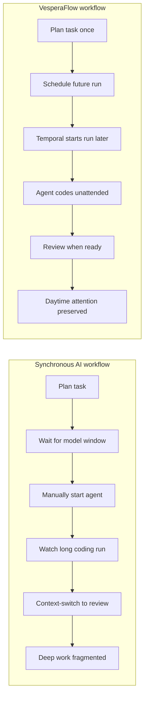
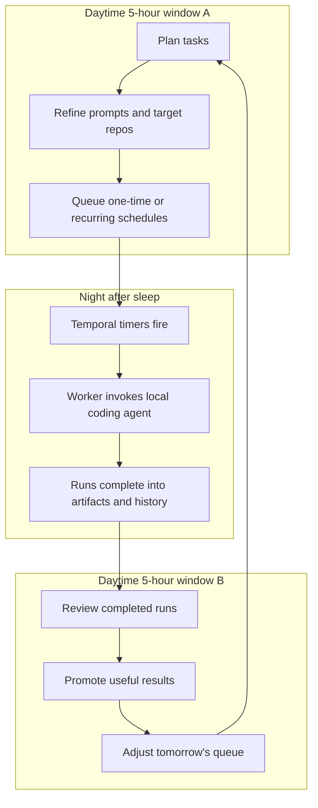

# VesperaFlow

VesperaFlow is a local-first scheduler for AI work. It lets you decide what an
AI agent should do now, run that work later when you are offline or in a better
usage window, and review the results when you choose.

The core problem is that AI work is still too synchronous: users plan, wait for
the right usage window, start the agent manually, wait for long tasks, and then
context-switch again to review the result. VesperaFlow separates planning from
execution so AI work no longer has to occupy the same attention window as the
user.

The design follows that separation:

- `Task` captures intent
- `Schedule` captures when it should run
- `Run` captures what actually happened
- Temporal owns durable scheduling and execution timers
- PostgreSQL owns product-visible task, schedule, run, and review state
- executor adapters invoke local agent runtimes such as Claude Code or Kimi Code

## Workflow Advantage

VesperaFlow does not make AI coding magically faster. It saves usable human time
by removing waiting, manual restarts, progress watching, and review
interruptions from the user's daytime focus windows.



The intended daily rhythm is to use daytime AI windows for planning and review,
then move coding action to unattended night runs after the user goes offline.



In practical terms, VesperaFlow turns the loop from `plan -> wait -> action ->
wait -> review` into `batch plan -> unattended action -> batch review`.

VesperaFlow is currently an MVP for a trusted local machine. It does not include
authentication or authorization, and it can invoke coding-agent executors that
operate on local directories. Do not expose the API, web dev server, Temporal,
or Postgres ports to an untrusted network.

The MVP is built around:

- FastAPI for the product API
- Temporal for durable scheduling and execution
- PostgreSQL for product-visible state
- Vue 3 for the local UI
- External coding-agent runtimes invoked through Worker Activities

## Repository Map

- `apps/api`: FastAPI app and task command/read endpoints.
- `apps/worker`: Temporal Worker, Workflows, Activities, executor adapters.
- `apps/web`: Vue UI, unit tests, and Playwright smoke tests.
- `packages/core`: shared domain enums, contracts, validation, and ID helpers.
- `packages/store`: SQLAlchemy persistence and Alembic migrations.
- `infra`: local Postgres and Temporal stack.
- `docs`: requirements, architecture, ADRs, quality, and implementation plans.

For agent-specific navigation, see `AGENTS.md`. For documentation navigation,
see `docs/README.md`.

## Security Model

VesperaFlow assumes a single trusted local user:

- the API has no login, sessions, API keys, or user authorization checks
- PostgreSQL may contain task instructions and executor output summaries
- the default local infrastructure uses development credentials
- the web and API dev servers are intended for local development only
- executor credentials are managed by the executor runtime, not VesperaFlow

The safe first-run path uses the `debug_printer` executor, which does not call an
external AI agent. Live executor runs are opt-in:

- `claude_code` runs Claude Code from a Worker Activity with
  `permission_mode="bypassPermissions"`
- `kimi_code` runs the `kimi` CLI with non-interactive auto-approval flags
- both executors can read and modify files in the selected target working
  directory according to the executor's own behavior
- executor output artifacts are written under `VESPERAFLOW_RUN_WORKSPACE_ROOT`

Only run live executors against directories you are comfortable letting an
unattended coding agent inspect and modify. Keep `.env`, executor credentials,
OAuth caches, and provider API keys out of git.

## Public Quickstart

Prerequisites:

- Python 3.13
- `uv`
- Bun
- Docker with Docker Compose

Install Python dependencies through the workspace:

```bash
uv sync
cp .env.example .env
```

Install web dependencies:

```bash
cd apps/web
bun install
cd ../..
```

Start local infrastructure:

```bash
cp infra/.env.example infra/.env
docker compose --env-file infra/.env -f infra/compose.dev.yaml up
```

Apply the database schema:

```bash
uv run --directory packages/store alembic upgrade head
```

Start the API:

```bash
uv run vesperaflow-api
```

Start the Worker in another terminal:

```bash
uv run vesperaflow-worker
```

Start the web app in another terminal:

```bash
cd apps/web
bun run dev
```

Open the Vite URL, normally `http://localhost:15173`, and create a one-time task
scheduled a minute or two in the future with the `debug_printer` executor. The
local stack also exposes the API on `http://localhost:18000`, Temporal on
`localhost:17233`, Temporal UI on `http://localhost:18080`, and Postgres on
`localhost:15432`.

For a deeper full-stack smoke run, see `docs/local-full-stack-runbook.md`.

## Live Executors

Use live executors only after the debug path works.

Claude Code requires a configured local Claude Code runtime and an executor
profile with any required provider environment values:

```bash
uv run vesperaflow-api
uv run vesperaflow-worker
```

Kimi Code requires the `kimi` CLI on `PATH` and a valid Kimi authentication
method such as its OAuth cache or supported environment variables:

```bash
uv run vesperaflow-api
uv run vesperaflow-worker
```

For live runs, choose an existing absolute target working directory and start
with a harmless instruction. Executor profile secret values are write-only in
API responses and are resolved only by Worker Activities.

## Checks

Python:

```bash
uv run ruff check .
uv run basedpyright
uv run pytest
```

Web:

```bash
cd apps/web
bun run type-check
bun run lint
bun run format
bun run test:unit:run
bun run test:e2e:smoke
```

Agent-first repo health:

```bash
python scripts/check_agent_repo.py
```
