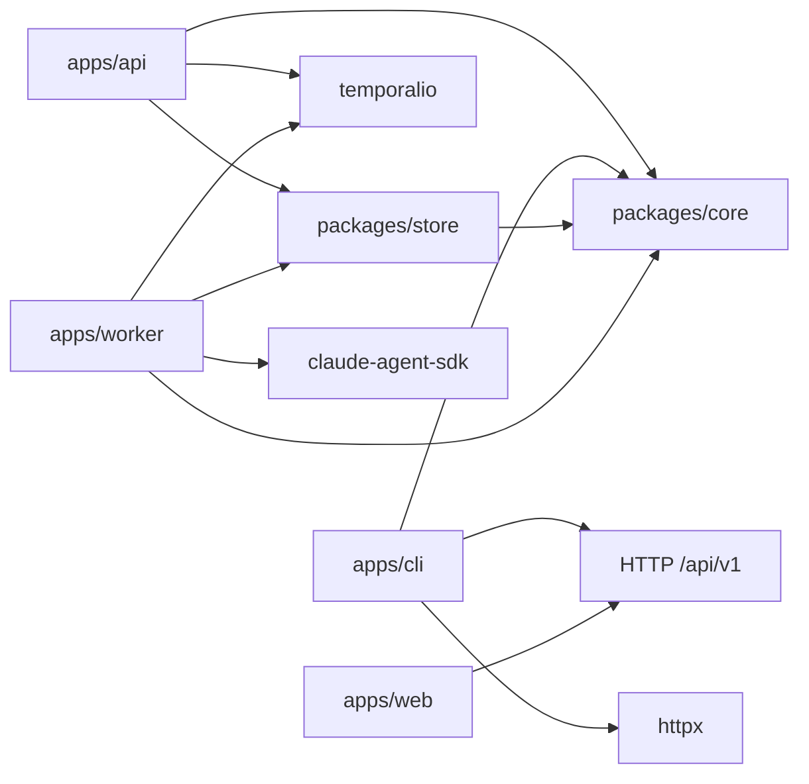

# Package Dependency Snapshot

- Generated: 2026-07-20
- Regenerate: `uv run python scripts/generate_agent_facts.py`
- Sources: `pyproject.toml`, `apps/*/pyproject.toml`, `packages/*/pyproject.toml`
- Limitations: generated from importable application metadata, not a live deployment.

## Notes

- `packages/core` is dependency-light and imported by Workflows.
- `packages/store` owns SQLAlchemy models and repository behavior.
- `apps/api` creates Temporal Schedules but does not execute agents.
- `apps/cli` is an API-only client for agents and scripts.
- `apps/worker` executes Workflows and Activities and owns executor adapters.
